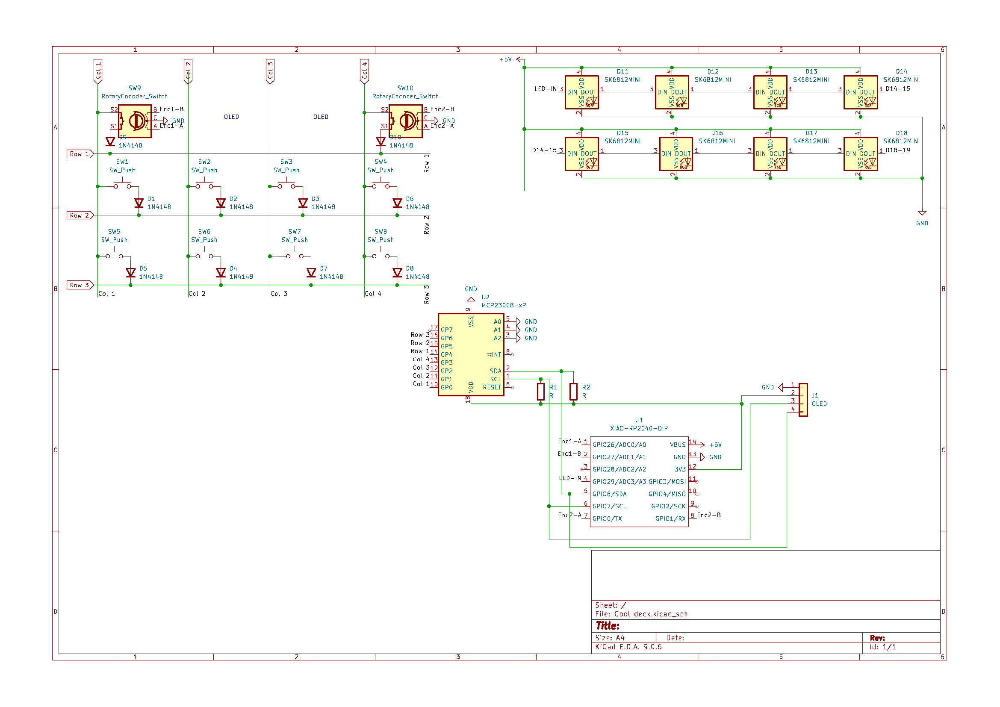
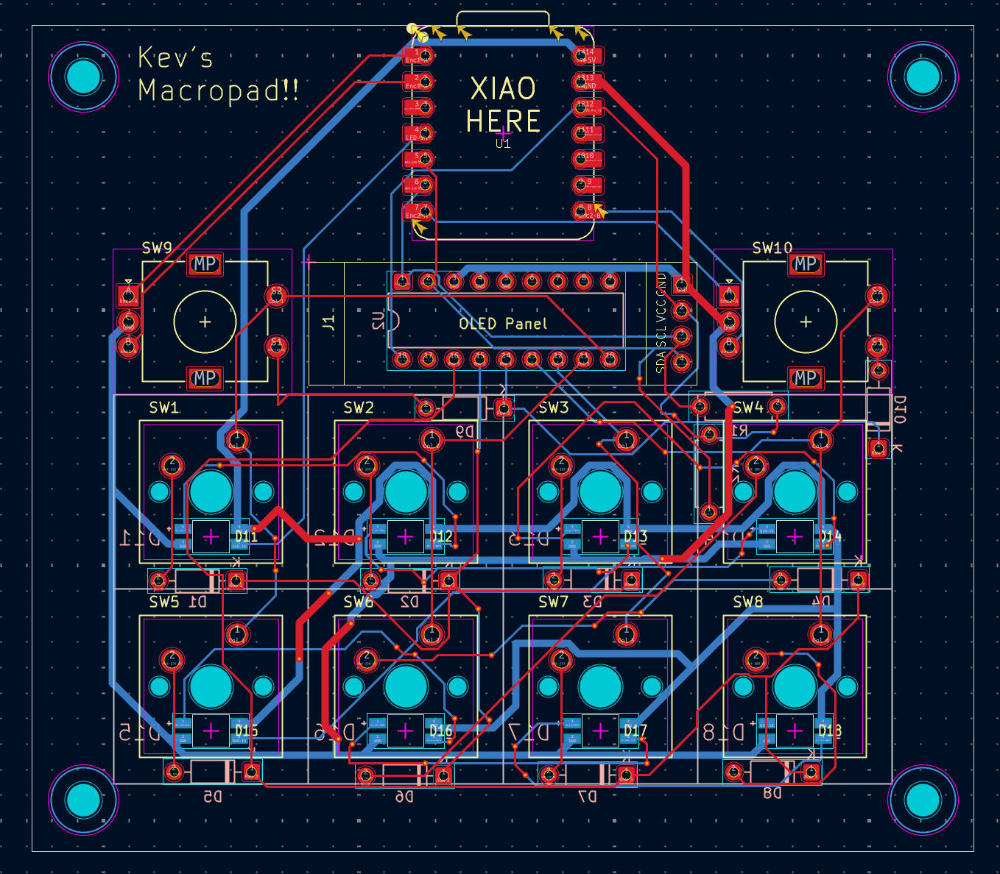
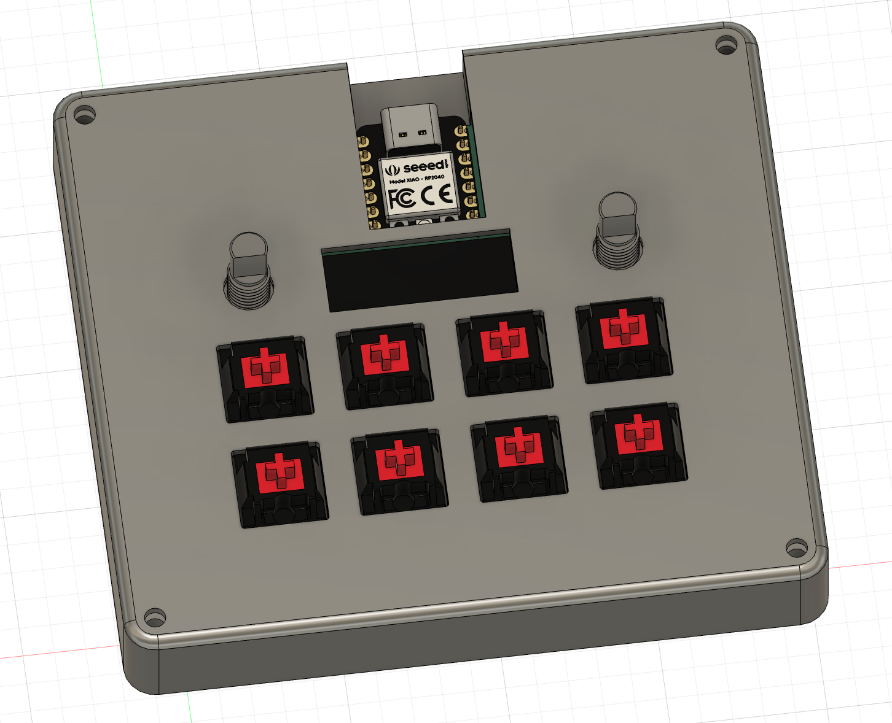
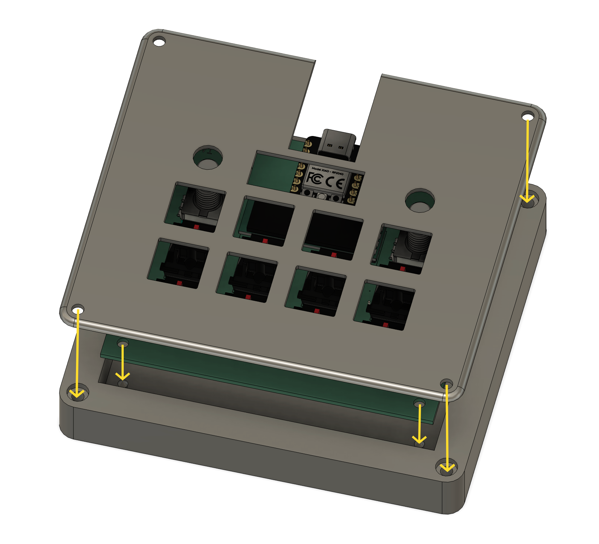

# Kev's Macropad - The Hybrid Macropad

This is my custom 10-key (8 MX, 2 encoder) mechanical macropad that has dual rotary encoders, per-key RGB lighting, and an OLED status screen. 
It is powered by the XIAO RP2040 and an MCP23008 I/O expander to make sure that I can do as much as I can on this board with such a small footprint.

## Images

### Schematic

### PCB

### Assembly

### Exploded Assembly

## Firmware
Firmware made using KMK

## BOM
> **`*`** denotes a part not included in the hackpad kit. I will supply them.

| **Part**  | **Qty** | **Description**                    | **Remarks**            |
|-----------|---------|------------------------------------|------------------------|
| MCU       | 1       | Xiao RP2040                        |                        |
| Expander  | 1       | MCP23008                           | *                      |
| Switches  | 8       | MX-style CLEAR mechanical switches |                        |
| Keycaps   | 8       | DSA or XDA Profile (1u)            |                        |
| Display   | 1       | 0.91" OLED 12C                     | Pinout GND-VCC-SDL-SDA |
| LEDs      | 8       | SK6812 MINI-E                      | Reverse-mount          |
| Resistors | 2       | 2.2kΩ or 4.7kΩ                     | * I2C Pull-ups         |
| Diodes    | 10      | 1N4148                             | Through-hole           |
| Hardware  | 4       | M3 x 16mm Screws                   | Case                   |
| Hardware  | 4       | M3 Heatset Inserts                 | 5mm x 4mm              |
